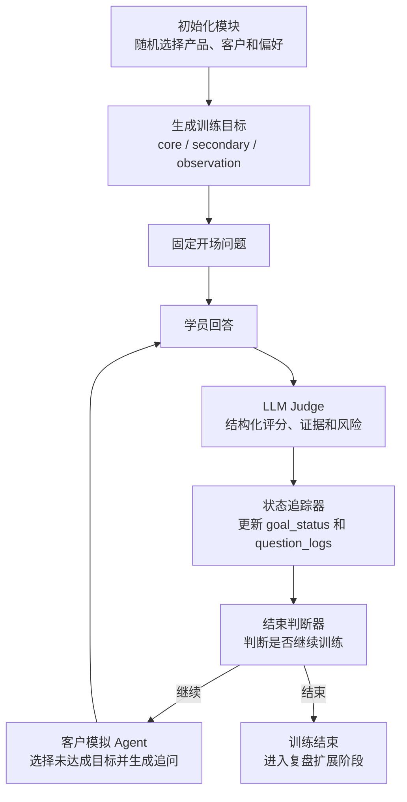

# Workflow 管控的 AI 销售训练 Agent

线上 Demo: [https://ai-sales-training-demo.streamlit.app](https://ai-sales-training-demo.streamlit.app)

> 说明：线上 Demo 部署在 Streamlit Cloud，部分网络环境可能需要科学上网才能访问。

这是一个面向销售培训场景的 **功能型原型 / MVP**。系统不是固定题库，也不是单轮聊天机器人，而是通过 Workflow 管控训练流程，让客户模拟 Agent、LLM Judge、状态追踪器和结束判断器组成一个可循环、可追踪、可解释的训练闭环。

当前版本重点展示的是后端 AI Workflow 与 agentic 训练逻辑：系统会随机生成训练场景，根据学员回答进行结构化评价，并围绕尚未达成的训练目标自动生成下一轮客户追问。

## 核心功能

### 1. Workflow 管控的训练闭环

系统由 Workflow 统一调度训练流程，避免让大模型完全自由决定流程顺序。每一轮训练都会经过：

1. 初始化训练场景
2. 生成客户问题
3. 学员回答
4. LLM Judge 结构化评价
5. 状态追踪器更新目标状态
6. 结束判断器决定是否继续
7. 客户模拟 Agent 生成下一轮追问

这种设计让系统既保留大模型的语言生成和理解能力，又通过代码层面的 Workflow 保持训练过程稳定、可控。

### 2. 客户模拟 Agent

客户模拟 Agent 会根据当前训练状态生成下一轮客户追问。它不会随机提问，而是结合当前产品、客户角色、客户偏好、训练目标、上一轮回答和 Judge 结果，优先追问尚未达成的核心目标或次级目标。

当某个目标已经达成时，系统不会继续围绕它重复测试；当某个目标连续多轮没有进展时，系统也会记录该目标的测试状态，避免训练过程变成机械重复。

### 3. 动态上下文 Prompt

本项目的 Prompt 不是静态模板。每次调用模型前，系统都会把当前 session 状态整理成结构化上下文，再注入到模型输入中。

动态上下文包括：

- 当前产品信息
- 当前客户画像
- 客户偏好强度
- 本次训练目标
- 每个目标的达成状态
- 当前轮次状态
- 上一轮问题、回答和评价结果
- 风险记录
- 下一轮追问计划

因此，模型生成的追问和评价不是孤立文本生成，而是基于当前训练状态的上下文推理。

### 4. LLM-as-a-Judge 结构化评价

LLM Judge 负责评价学员回答是否满足训练目标。它不会决定下一轮问题，也不会修改系统状态，只输出结构化评价结果。

当前 Judge 机制包括：

- 只评价本轮需要测试的目标
- 每个目标输出 0-4 分
- 3 分及以上视为目标达成
- 为每个目标记录 evidence、reason、confidence
- 检查回答中是否存在明显风险表达
- 输出统一 JSON，交给状态追踪器继续处理

这种设计把“评价”和“流程控制”分开，避免大模型同时承担过多职责，也让系统结果更容易追踪和调试。

### 5. 训练目标与状态追踪

系统将训练目标分为：

- 核心目标：必须重点验证
- 次级目标：影响训练表现与后续复盘
- 观察目标：不强制追问，但如果学员自然体现，会被记录

每轮 Judge 结束后，状态追踪器会更新每个目标的最新分数、最高分、证据、达成轮次和风险状态。结束判断器再根据这些状态决定训练是否继续。

### 6. 简要合规意识

LLM Judge 中加入了基础风险检查，例如避免夸大效果、虚构证据或给出不恰当承诺。该部分仅作为原型中的合规意识设计，不构成专业合规判断。

## 系统架构



## 技术栈

- Python
- Streamlit
- OpenAI-compatible SDK
- JSON 配置数据
- Prompt Engineering
- LLM-as-a-Judge
- Workflow Orchestration

## 项目结构

```txt
ai-sales-training-system/
├── app/
│   └── main.py                         # Streamlit 前端入口
├── core/
│   ├── workflow.py                     # Workflow 调度主流程
│   ├── initialization.py               # 场景初始化与训练目标生成
│   ├── customer_simulator.py           # 固定开场问题
│   ├── customer_simulator_next.py      # 下一轮客户追问生成
│   ├── judge.py                        # LLM Judge 评价模块
│   ├── state_tracker.py                # 训练状态更新
│   ├── termination.py                  # 结束判断逻辑
│   ├── llm_client.py                   # 模型调用封装
│   └── prompt_context/                 # 动态上下文构造
├── data/
│   ├── products.json                   # 示例产品数据
│   ├── customers.json                  # 示例客户数据
│   └── customer_preferences.json       # 客户偏好与目标规则
├── prompts/
│   ├── judge_answer_system.txt         # Judge 系统提示词
│   └── next_customer_followup_system.txt
├── requirements.txt
└── README.md
```

## 本地运行

### 1. 克隆项目

```bash
git clone https://github.com/xuanang-chen/ai-sales-training-system.git
cd ai-sales-training-system
```

### 2. 创建虚拟环境

```bash
python3 -m venv .venv
source .venv/bin/activate
```

Windows 可以使用：

```bash
.venv\Scripts\activate
```

### 3. 安装依赖

```bash
pip install -r requirements.txt
```

### 4. 配置本地环境变量

在项目根目录创建 `.env` 文件，并填写模型服务相关配置：

```txt
ARK_API_KEY=your_key_here
ARK_BASE_URL=your_base_url_here
ARK_MODEL=your_model_name_here
```

`.env` 已经被 `.gitignore` 忽略，请不要提交真实密钥。

### 5. 启动应用

```bash
streamlit run app/main.py
```

启动后浏览器会打开本地页面。如果没有自动打开，可以访问终端中显示的本地地址。

## 当前完成度

当前版本已经完成一个可运行的 AI 销售训练 MVP：

- 随机训练场景初始化
- 产品、客户、偏好数据读取
- 训练目标自动生成
- 多轮 Workflow 调度
- 客户模拟追问生成
- LLM Judge 结构化评价
- 训练状态追踪
- 结束判断逻辑
- Streamlit 可视化交互界面
- Streamlit Cloud 线上部署

当前版本仍然是原型系统，不是生产级企业训练平台。

## 这个项目展示的能力

- AI Workflow 设计：将初始化、评价、状态更新、结束判断和追问生成拆成独立模块
- Agentic System 设计：在 Workflow 控制下实现动态客户追问与目标驱动训练
- Prompt Engineering：构造动态上下文 Prompt，而不是只写静态角色提示词
- LLM Evaluation：使用 LLM-as-a-Judge 对学员回答进行结构化评分
- 状态管理：用共享 session state 追踪目标达成、证据、轮次和风险
- 产品原型能力：用 Streamlit 快速搭建可交互 Demo
- 工程实现能力：将业务规则、数据配置、模型调用和 UI 展示分层实现

## 数据说明

本项目中的产品、客户和偏好数据均为示例数据，仅用于功能展示和原型验证。

## 后续规划（Future Work）

后续可以从以下方向继续扩展：

### 1. 复盘报告生成

在训练结束后，根据完整对话记录、目标达成情况、Judge 证据和风险记录，自动生成训练复盘报告。报告可以包括已掌握能力、薄弱能力、关键回答证据、改进建议和下一次训练重点。

### 2. RAG 知识增强

接入企业知识库，将产品资料、标准话术、培训手册、销售案例和合规规范作为可检索知识来源。客户模拟和 Judge 不再只依赖当前 JSON 数据，而是可以基于检索结果生成更贴近真实业务的追问和评价。

### 3. 更细粒度的 Agent 分工

当前版本中客户模拟 Agent 同时承担追问生成和部分测评规划。后续可以拆分为：

- 客户角色模拟 Agent
- 训练目标规划 Agent
- 追问策略 Agent
- 复盘建议 Agent

这样可以让每个 Agent 的职责更清晰，也方便单独评估和优化。

### 4. 评估标准校准

引入人工标注样例，对 LLM Judge 的评分进行校准。后续可以建立标准答案、评分 Rubric 和人工评审对照集，用来评估 Judge 的一致性、稳定性和可解释性。

### 5. 学员历史画像

保存不同训练会话中的表现数据，形成学员能力画像。系统可以根据历史薄弱项自动推荐下一次训练场景，实现更个性化的训练路径。

### 6. 管理端与数据看板

为培训管理者提供整体训练数据看板，例如目标达成率、常见风险表达、平均训练轮次、不同能力项表现分布等，用于支持团队培训分析。

### 7. 更强的安全与权限设计

如果进入真实企业环境，需要加入用户登录、角色权限、数据隔离、日志审计和密钥管理，确保训练数据与模型调用过程可控。

### 8. 多行业与多语言扩展

当前原型主要围绕销售训练与中文交互。后续可以扩展到不同行业场景，并支持中英文双语训练。

## 免责声明

本项目仅用于学习、作品展示和原型验证，不构成医疗、法律、合规或商业建议。
